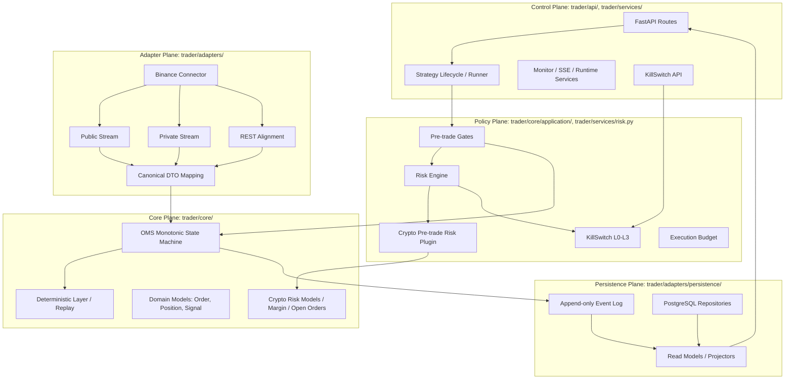
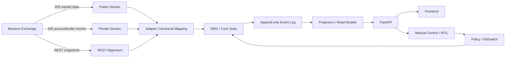
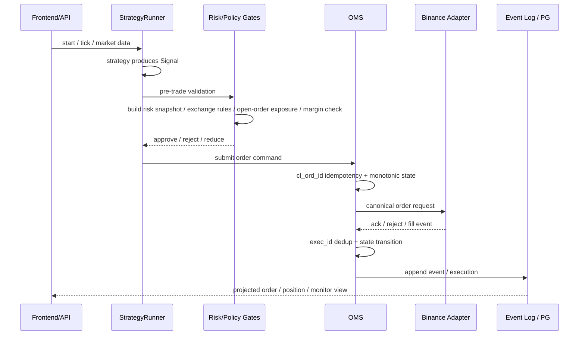
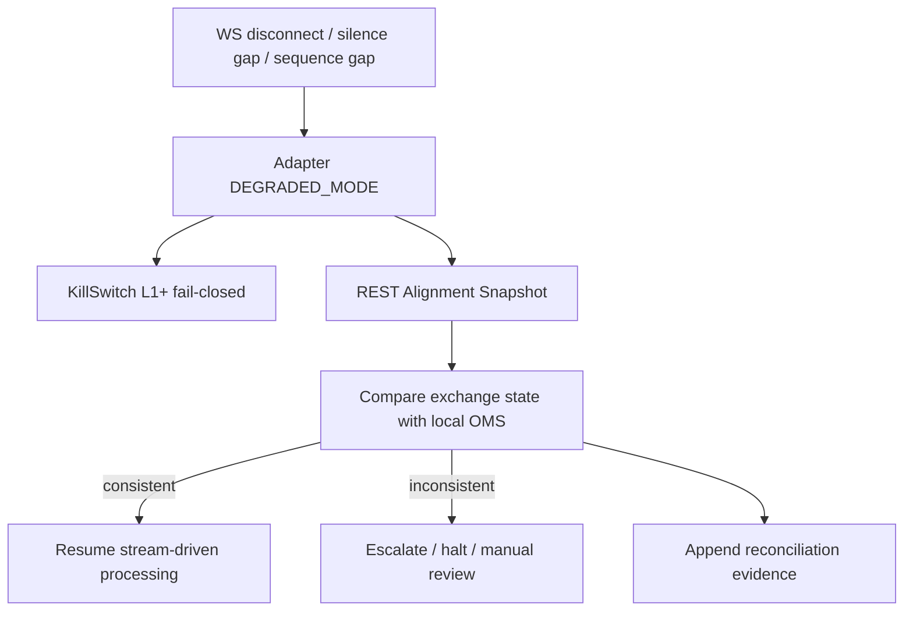
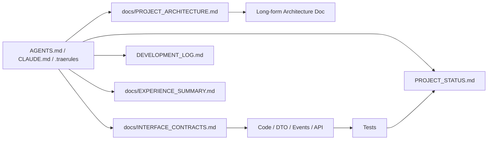

# 项目架构图

> 本文档是当前运行架构的图文入口，用于快速理解系统边界、主数据流和关键闭环。
> 长篇架构说明见 `docs/quant_trading_system Crypto v3.4.0_Architecture.md`；接口命名与 DTO 契约见 `docs/INTERFACE_CONTRACTS.md`。

## 文档状态

- 最后更新: 2026-05-03 00:00 (北京时间)
- 维护规则: 任何影响层级边界、模块职责、跨层调用、主数据流、持久化路径、风控闭环、部署/运行拓扑的架构变更，必须同步更新本文档。
- 当前架构基线: 五层平面架构 + Event Sourcing + Adapter 边界清洗 + Policy Fail-Closed。

---

## 1. 五层平面架构

### 层级约束

| 层 | 核心职责 | 禁止事项 |
|----|----------|----------|
| Core | 订单状态机、确定性回放、领域模型 | IO、网络、DB、环境变量、交易所原始字段 |
| Adapter | 外部 IO、字段清洗、REST/WS 对齐、脏数据隔离 | 直接修改 Core 内部状态、Public/Private Stream 共享状态 |
| Persistence | Event Sourcing、PG 仓储、投影读模型 | 绕过事件语义覆盖真相源 |
| Policy | 风险决策、KillSwitch、预算/余额 gate | Fail-open、绕过风险决策下单 |
| Control | API、生命周期管理、监控聚合、人工控制入口 | 绕过 Risk/Policy/Core 直连交易 |

---

## 2. 主数据流

### 数据流规则

- WS 负责低延迟驱动，REST 负责最终一致性校准。
- Adapter 将外部字段转换为内部标准字段，Core 不接收交易所原始 payload。
- Event Log 是状态回放真相源，读模型只是投影。
- 控制面操作必须经过 Policy / KillSwitch，不得绕过 Core 状态机。

---

## 3. 策略到下单闭环

### 闭环不变性

- 下单前必须经过风险、余额、预算和 KillSwitch gate。
- 订单幂等主键是 `cl_ord_id`；成交幂等键是 `cl_ord_id + exec_id`。
- 终态订单不得回退。
- Broker 异常必须按业务拒单和网络不确定性区分处理。

### Crypto 独立风控补充

- 策略只提交 `Signal` / trade intent；最终放行、拒绝、缩量建议和 KillSwitch 建议由 Policy Plane 决定。
- `CryptoPreTradeRiskPlugin` 通过 `CryptoRiskSnapshot` 读取账户、规则、mark price、在途订单、持仓和风险预算；快照构建可由 Adapter/Service 注入，但 Core 计算保持无 IO。
- `ExchangeRuleGuard`、`OpenOrderExposureCalculator`、`MarginRiskCalculator` 均位于 Core domain service，负责交易所规则、在途订单最坏占用和合约保证金纯计算。
- 在途 `reduce_only` 订单不得提前释放风险预算；只有成交事件进入账本后才减少真实风险。

---

## 4. 对账与恢复闭环

### 恢复规则

- WS 断线、静默、序列跳变后必须先 REST Alignment。
- 无法解释的不一致必须 fail-closed，并升级 KillSwitch。
- 对账证据必须可追踪，不能用 `except: pass` 静默吞错。

---

## 5. 文档与契约关系

### 文档分工

| 文档 | 职责 |
|------|------|
| `docs/PROJECT_ARCHITECTURE.md` | 当前架构图、主数据流、闭环拓扑、架构更新触发条件 |
| `docs/quant_trading_system Crypto v3.4.0_Architecture.md` | 长篇架构原则、阶段能力说明、背景解释 |
| `docs/INTERFACE_CONTRACTS.md` | 命名、DTO、事件 Schema、跨层接口契约 |
| `PROJECT_STATUS.md` | 当前状态和最近任务结果 |
| `DEVELOPMENT_LOG.md` | 只追加的开发过程记录 |
| `docs/EXPERIENCE_SUMMARY.md` | 踩坑、模式、可复用经验 |

---

## 6. 研究到自动组合运行闭环

```mermaid
flowchart LR
    Data["Crypto Core Data Sources"] --> FeatureStore["FeatureStore / feature_version"]
    FeatureStore --> Candidate["StrategyCandidate Lifecycle"]
    Candidate --> Debug["Code Debug Gate"]
    Debug --> Backtest["Backtest Dataset + Report"]
    Backtest --> Validation["Validation Gate"]
    Validation --> Promote["Promote to Deployment"]
    Promote --> Allocation["Capital Allocation / RiskSizer"]
    Allocation --> Runtime["Paper/Shadow Runtime"]
    Runtime --> Autopilot["Portfolio Runtime Controller"]
    Autopilot -->|"START/PAUSE/STOP/REDUCE"| Runtime
    Autopilot --> Audit["Audit / Replay Events"]
```

### 闭环规则

- `candidate_id` 管策略研究生命周期，`strategy_id` 管策略模板，`deployment_id` 管运行实例，三者不得混用。
- 回测必须显式记录 `feature_version` 和 `data_mode`；`dev_smoke` 只能用于开发烟测，不能作为部署准入。
- 策略信号进入 OMS 前必须经过仓位分配与风险裁剪，分配结果写入 `AllocationTrace`。
- Portfolio Runtime Controller 第一版面向 paper/shadow 自动运行，所有启停/降仓决策写入审计事件。

---

## 7. 架构变更更新规则

以下情况必须更新本文档：

1. 新增、删除或重命名关键模块、服务、平面职责。
2. 改变 Core / Adapter / Persistence / Policy / Control 任一层边界。
3. 改变订单、成交、风控、对账、恢复、持久化主数据流。
4. 改变 Event Log、PG 仓储、投影读模型的责任分工。
5. 改变 KillSwitch、Risk Gate、Execution Budget 的调用顺序或失效语义。
6. 改变前后端 API 的主链路或部署/运行拓扑。

更新顺序：

1. 先更新 `docs/PROJECT_ARCHITECTURE.md` 中受影响图和约束。
2. 如果涉及接口、DTO、事件或字段命名，同步更新 `docs/INTERFACE_CONTRACTS.md`。
3. 修改实现和测试，遵循 TDD Red → Green → Refactor。
4. 按规则更新 `PROJECT_STATUS.md`、`DEVELOPMENT_LOG.md`、`docs/EXPERIENCE_SUMMARY.md`。
5. 如改变阶段目标、优先级或当前执行入口，同步更新 `docs/PLAN.md` 或阶段计划文档。
