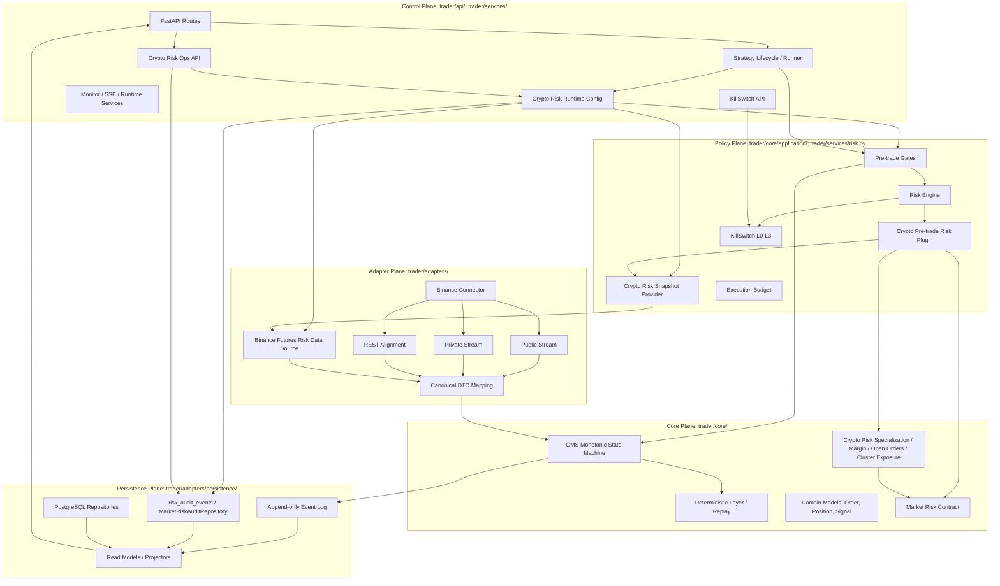
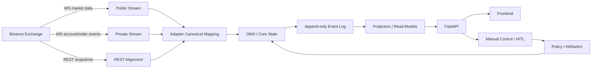
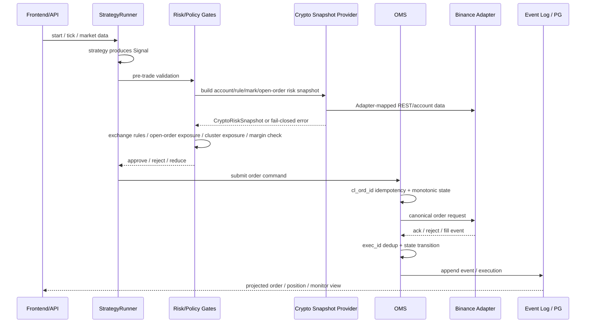
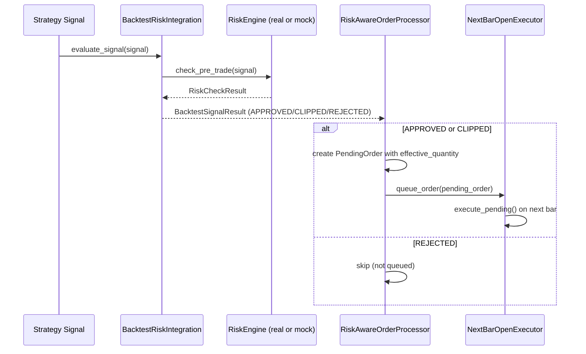
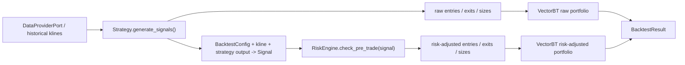
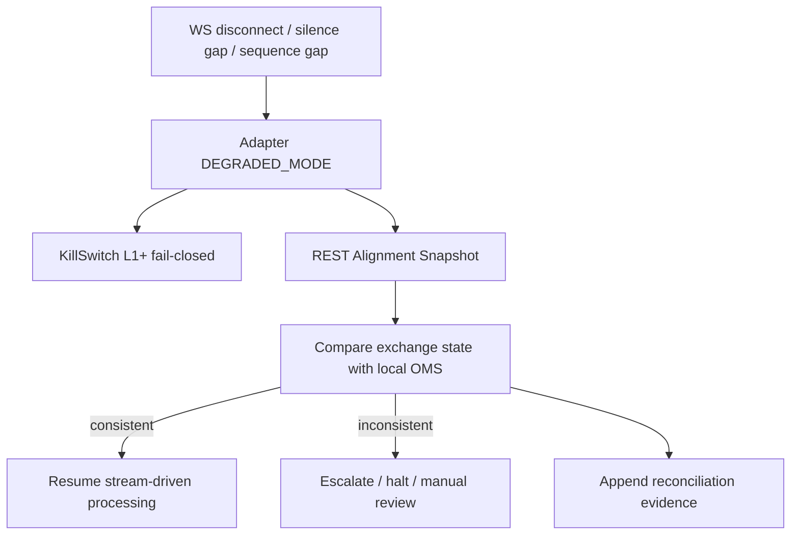
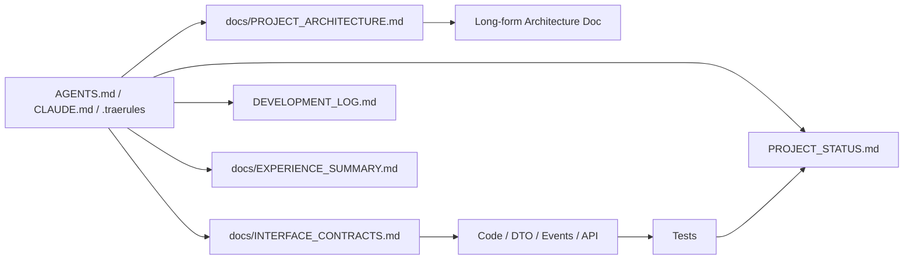

# 项目架构图

> 本文档是当前运行架构的图文入口，用于快速理解系统边界、主数据流和关键闭环。
> 长篇架构说明见 `docs/quant_trading_system Crypto v3.4.0_Architecture.md`；接口命名与 DTO 契约见 `docs/INTERFACE_CONTRACTS.md`。

## 文档状态

- 最后更新: 2026-05-07 03:30 (北京时间)
- 维护规则: 任何影响层级边界、模块职责、跨层调用、主数据流、持久化路径、风控闭环、部署/运行拓扑的架构变更，必须同步更新本文档。
- 当前架构基线: 五层平面架构 + Event Sourcing + Adapter 边界清洗 + Policy Fail-Closed。

---

## 1. 五层平面架构

### 层级约束

| 层 | 核心职责 | 禁止事项 |
|----|----------|----------|
| Core | 订单状态机、确定性回放、领域模型 | IO、网络、DB、环境变量、交易所原始字段 |
| Adapter | 外部 IO、字段清洗、REST/WS 对齐、脏数据隔离 | 直接修改 Core 内部状态、Public/Private Stream 共享状态 |
| Persistence | Event Sourcing、PG 仓储、投影读模型 | 绕过事件语义覆盖真相源 |
| Policy | 风险决策、KillSwitch、预算/余额 gate | Fail-open、绕过风险决策下单 |
| Control | API、生命周期管理、监控聚合、人工控制入口 | 绕过 Risk/Policy/Core 直连交易 |

---

## 2. 主数据流

### 数据流规则

- WS 负责低延迟驱动，REST 负责最终一致性校准。
- Adapter 将外部字段转换为内部标准字段，Core 不接收交易所原始 payload。
- Event Log 是状态回放真相源，读模型只是投影。
- 控制面操作必须经过 Policy / KillSwitch，不得绕过 Core 状态机。

---

## 3. 策略到下单闭环

### 闭环不变性

- 下单前必须经过风险、余额、预算和 KillSwitch gate。
- 订单幂等主键是 `cl_ord_id`；成交幂等键是 `cl_ord_id + exec_id`。
- 终态订单不得回退。
- Broker 异常必须按业务拒单和网络不确定性区分处理。

### Crypto 独立风控补充

- `MarketRiskSnapshot`、`MarketInstrumentSpec`、`MarketRiskBudget` 和 `MarketRiskAuditEvent` 是 Core / Policy / Persistence 的市场无关风险契约；Crypto 风控继续保留为 specialization，通过转换方法投影到通用契约。
- 策略只提交 `Signal` / trade intent；最终放行、拒绝、缩量建议和 KillSwitch 建议由 Policy Plane 决定。
- `CryptoPreTradeRiskPlugin` 通过 `CryptoRiskSnapshot` 读取账户、规则、mark price、在途订单、持仓和风险预算；`DataSourceCryptoRiskSnapshotProvider` 位于 Service 层，调用 Adapter 边界清洗后的 `CryptoRiskDataSource` 构建快照，Core 计算保持无 IO。
- `trader/api/crypto_risk_runtime.py` 位于 Control Plane，解析 `CRYPTO_RISK_*` 环境配置，默认关闭；显式启用时由 lifespan 创建 Binance USD-M source、snapshot provider，并把 `pre_trade_risk_check` late-bind 到 OMS。
- 当 `CRYPTO_RISK_ENABLED=true` 但凭证缺失、配置非法或 runtime wiring 失败时，Control Plane 会注入 fail-closed risk check，后续 OMS 下单必须拒绝而不是绕过独立风控。
- `GET /v1/risk/crypto/runtime` 暴露 runtime 状态；`PATCH /v1/risk/crypto/budget` 仅热更新 `CryptoRiskBudget` 并重建 snapshot provider / pre-trade check，不重新创建 Binance source 或泄露凭证。
- 每次预算热更新成功后写入控制面事件流 `risk:crypto` / `crypto_risk.budget_updated`；专用审计查询与通用 `/v1/events` 共用同一来源，便于回放与运维追踪。
- `POST /v1/risk/crypto/probe` 是 Control Plane 的只读 readiness probe；它复用已 wired 的 USD-M 风控 source 读取账户风险、mark price、交易规则、杠杆分层、持仓、在途订单和 venue health，并写入 `risk:crypto` / `crypto_risk.probe_run` 审计事件。
- `MarketRiskAuditRepository` 负责 PG-first 风险审计持久化；`risk:crypto` 通过 `risk_audit_events` 的 `stream_key` 过滤展示，同时保留控制面内存事件投影作为 PG 不可用时的回退和旧 `/v1/events` 兼容视图。
- Runtime 注入 OMS 的 crypto `pre_trade_risk_check` 会由 Control/Service wrapper 增补拒绝审计；当风控结果为拒绝或风控回调异常时，写入 `risk:crypto` / `crypto_risk.pre_trade_rejected`，但不改变 Core plugin 的无 IO 边界，也不让审计故障覆盖原始 fail-closed 决策。
- `decision_trace_id` 是业务决策链路 ID；crypto budget/probe/pre-trade 审计会把它写入 `MarketRiskAuditEvent.trace_id` 与 payload，`GET /v1/risk/crypto/audit` 可按 `trace_id` 或 `signal_id` 查询 PG-first evidence。
- 当前执行适配器仍是 Binance Spot Demo 路径；`execution_env=demo` 反映实际执行环境，USD-M source 的 `mode` 仅描述只读风控数据源 URL，不代表 Futures 下单能力。
- Frontend `/crypto-risk` 运维页通过 `GET /v1/risk/crypto/runtime`、`PATCH /v1/risk/crypto/budget`、`POST /v1/risk/crypto/probe` 和 `/v1/events?stream_key=risk:crypto` 完成状态查看、预算热更新、只读联通性检查与审计追踪。
- `BinanceFuturesRiskDataSource` 位于 Adapter 层，只在该层处理 `clientOrderId`、`positionAmt`、`markPrice`、`notionalCap` 等 Binance 原始字段，并在进入 Service 前转换为内部 DTO。
- `ExchangeRuleGuard`、`OpenOrderExposureCalculator`、`PortfolioExposureAggregator`、`MarginRiskCalculator` 均位于 Core domain service，负责交易所规则、在途订单最坏占用、组合级 group/cluster 敞口和合约保证金纯计算；前三者只依赖市场无关字段，`MarginRiskCalculator` 保持 crypto/futures 专用。
- `CryptoRiskBudget` 支持 `symbol_clusters` 与 `cluster_notional_caps`；cluster 风险按"已成交持仓 + active open orders + 本次拟下单"聚合，命中 cap 时由 Policy Plane 拒绝，不修改 OMS 状态。
- 在途 `reduce_only` 订单不得提前释放风险预算；只有成交事件进入账本后才减少真实风险。
- OMS 下单入口可注入独立 `pre_trade_risk_check` 回调；该回调拒绝或异常时必须在 broker `place_order` 之前阻断订单。

### Funding/OI 历史窗口风控补充

- P4.6 新增 Funding/OI 历史窗口派生能力，由 Core 纯计算 + Service 层 Provider 组成。
- Core 层 `FundingOIWindowCalculator` 位于 `trader/core/domain/services/funding_oi_window_calculator.py`，无任何 IO 操作。
- Service 层 `FundingOIMetricsProvider` 位于 `trader/services/funding_oi_metrics_provider.py`，通过 `FundingOIHistoryPort` 和 `CurrentFundingOIPort` 从 FeatureStore 读取历史数据。
- `CryptoFundingOIRiskMetrics` 支持 funding 和 OI 独立计算，包含独立缺失标志：`funding_data_stale`、`oi_data_stale`、`funding_window_insufficient`、`oi_window_insufficient`、`funding_current_missing`、`oi_current_missing`。
- 缺 funding 不影响 OI 指标，缺 OI 不影响 funding 指标。
- 当前值缺失时返回 `None`，并设置对应 `_missing` 标志，不转成 `0.0` 制造虚假 Z-Score。
- `open_interest_change_rate` 为百分比变化率 `(current_oi - mean) / mean * 100`，不是 Z-Score。
- 运行时环境变量（`CRYPTO_RISK_MAX_ABS_FUNDING_RATE_Z_SCORE` 等）待 P4.8 接入 `CryptoPreTradeRiskPlugin`。

### 回测市场无关补充

- `VectorBTAdapter` 通过 `DataProviderPort` 获取历史 K 线；Binance 历史数据源只作为默认装配，A 股或其他市场数据源应在 Service/Adapter 层注入。
- 回测执行成本、交易时段、T+1、涨跌停和 lot 约束不得写死在 engine 内，应通过市场规则或执行模型 specialization 接入。

### P7 回测风控集成路径

回测层通过 `BacktestRiskIntegration` 接入真实风控，分为订单入队路径和 VectorBT 风控后权益曲线路径：

关键约束：
- `BacktestRiskIntegration` 通过 `risk_engine.check_pre_trade()` 调用完整风控，不绕过 RiskEngine
- `BacktestRiskEnginePort` Protocol 支持注入模拟 RiskEngine（回测）或真实 RiskEngine（生产）
- `RiskAwareOrderProcessor` 将 APPROVED/CLIPPED 结果转换为 `PendingOrder` 并加入执行器队列
- REJECTED 信号不进入执行器队列，不进入成交模拟
- CLIPPED 信号使用 `max_allowed_qty` 作为 `effective_quantity`

VectorBT 路径由 `VectorBTAdapterWithRisk` 负责：

关键约束：
- VectorBT 风控路径不得硬编码 symbol、price 或 quantity；必须使用 `BacktestConfig`、K 线价格和策略显式输出
- REJECTED 信号在风控后输入序列中写为 `entry=False`、`exit=False`、`size=0`
- CLIPPED 信号必须把 `effective_quantity` 写入 VectorBT `size`，让风控后权益曲线真实改变
- `BacktestResult.max_drawdown` 保持原始含义，风控后回撤写入 `max_drawdown_after_risk` 和 `risk_adjusted_metrics`

---

## 4. 对账与恢复闭环

### 恢复规则

- WS 断线、静默、序列跳变后必须先 REST Alignment。
- 无法解释的不一致必须 fail-closed，并升级 KillSwitch。
- 对账证据必须可追踪，不能用 `except: pass` 静默吞错。

---

## 5. 文档与契约关系

### 文档分工

| 文档 | 职责 |
|------|------|
| `docs/PROJECT_ARCHITECTURE.md` | 当前架构图、主数据流、闭环拓扑、架构更新触发条件 |
| `docs/quant_trading_system Crypto v3.4.0_Architecture.md` | 长篇架构原则、阶段能力说明、背景解释 |
| `docs/INTERFACE_CONTRACTS.md` | 命名、DTO、事件 Schema、跨层接口契约 |
| `PROJECT_STATUS.md` | 当前状态和最近任务结果 |
| `DEVELOPMENT_LOG.md` | 只追加的开发过程记录 |
| `docs/EXPERIENCE_SUMMARY.md` | 踩坑、模式、可复用经验 |

---

## 6. 研究到自动组合运行闭环

### 闭环规则

- `candidate_id` 管策略研究生命周期，`strategy_id` 管策略模板，`deployment_id` 管运行实例，三者不得混用。
- 回测必须显式记录 `feature_version` 和 `data_mode`；`dev_smoke` 只能用于开发烟测，不能作为部署准入。
- 策略信号进入 OMS 前必须经过仓位分配与风险裁剪，分配结果写入 `AllocationTrace`。
- Portfolio Runtime Controller 第一版面向 paper/shadow 自动运行，所有启停/降仓决策写入审计事件。

---

## 7. 架构变更更新规则

以下情况必须更新本文档：

1. 新增、删除或重命名关键模块、服务、平面职责。
2. 改变 Core / Adapter / Persistence / Policy / Control 任一层边界。
3. 改变订单、成交、风控、对账、恢复、持久化主数据流。
4. 改变 Event Log、PG 仓储、投影读模型的责任分工。
5. 改变 KillSwitch、Risk Gate、Execution Budget 的调用顺序或失效语义。
6. 改变前后端 API 的主链路或部署/运行拓扑。

更新顺序：

1. 先更新 `docs/PROJECT_ARCHITECTURE.md` 中受影响图和约束。
2. 如果涉及接口、DTO、事件或字段命名，同步更新 `docs/INTERFACE_CONTRACTS.md`。
3. 修改实现和测试，遵循 TDD Red → Green → Refactor。
4. 按规则更新 `PROJECT_STATUS.md`、`DEVELOPMENT_LOG.md`、`docs/EXPERIENCE_SUMMARY.md`。
5. 如改变阶段目标、优先级或当前执行入口，同步更新 `docs/PLAN.md` 或阶段计划文档。
