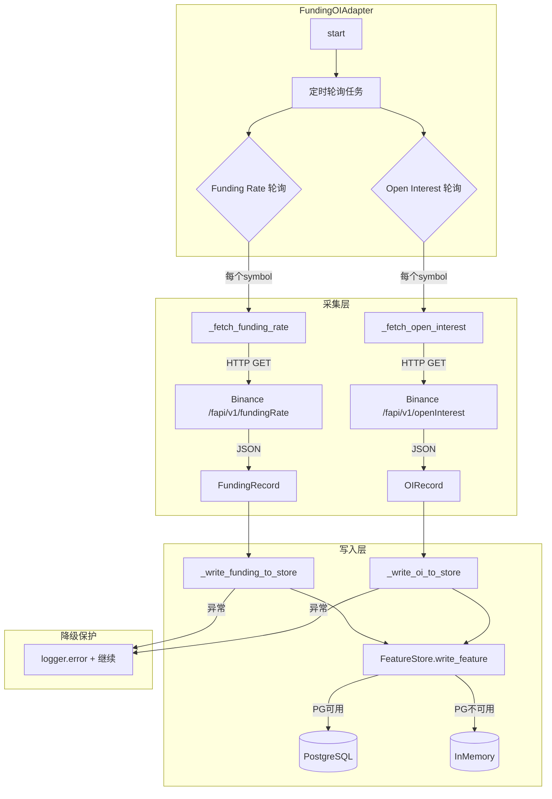

# Task 2.1 Funding/OI适配器 - 详细需求分析与实现评估

## 一、任务背景

**来源**：PLAN.md 四、Phase 2 — 研究信号层 / Task 2.1

**目标**：完整实现 Funding/OI 数据适配器，从 Binance Futures API 采集 Funding Rate 和 Open Interest 数据并写入 Feature Store。

---

## 二、验收标准分析

| 验收标准 | 状态 | 实现位置 |
|---------|------|---------|
| Funding rate数据写入Feature Store | ✅ 已完成 | [`_write_funding_to_store()`](trader/adapters/binance/funding_oi_stream.py:367) |
| OI数据写入Feature Store | ✅ 已完成 | [`_write_oi_to_store()`](trader/adapters/binance/funding_oi_stream.py:407) |
| 采集失败不影响主交易流程（降级日志） | ✅ 已完成 | 各方法内的 try-except + logger.error |

---

## 三、现有代码架构分析

### 3.1 核心组件

```
FundingOIAdapter
├── FundingOIConfig (配置类)
│   ├── base_url: str = "https://fapi.binance.com"
│   ├── funding_poll_interval: float = 1800s (30分钟)
│   ├── oi_poll_interval: float = 300s (5分钟)
│   ├── request_timeout: float = 10s
│   ├── max_retries: int = 3
│   └── funding_pre_trigger_minutes: int = 30
│
├── 数据记录类
│   ├── FundingRecord (funding_rate)
│   ├── OIRecord (open_interest)
│   └── LongShortRatioRecord (多空比 - Task 2.5)
│
└── 核心方法
    ├── _fetch_funding_rate() - REST拉取 funding rate
    ├── _fetch_open_interest() - REST拉取 open interest
    ├── fetch_long_short_ratio() - REST拉取多空比 (Task 2.5)
    ├── _write_funding_to_store() - 写入 funding_rate
    ├── _write_oi_to_store() - 写入 open_interest
    ├── store_long_short_ratio() - 写入 long_short_ratio (Task 2.5)
    ├── _fetch_all_funding_rates() - 批量拉取
    ├── _fetch_all_open_interests() - 批量拉取
    ├── _funding_poll_loop() - 定时轮询
    └── _oi_poll_loop() - 定时轮询
```

### 3.2 API 端点映射

| Binance API | 方法 | Feature Store feature_name |
|------------|------|---------------------------|
| `GET /fapi/v1/fundingRate` | [`_fetch_funding_rate()`](trader/adapters/binance/funding_oi_stream.py:134) | `funding_rate` |
| `GET /fapi/v1/openInterest` | [`_fetch_open_interest()`](trader/adapters/binance/funding_oi_stream.py:188) | `open_interest` |
| `GET /fapi/v1/topLongShortPositionRatio` | [`fetch_long_short_ratio()`](trader/adapters/binance/funding_oi_stream.py:237) | `long_short_ratio` |

---

## 四、Feature Store 写入语义

### 4.1 写入参数

```python
await self._feature_store.write_feature(
    symbol=record.symbol,           # 如 "BTCUSDT"
    feature_name="funding_rate",    # 或 "open_interest"
    version="v1",                   # 固定版本
    ts_ms=record.exchange_ts_ms,    # 交易所时间戳
    value={...},                    # 特征值
    meta={...},                     # 元数据
)
```

### 4.2 幂等性保证

- 同 key（symbol + feature_name + version + ts_ms）同 value → 幂等成功（返回 `is_dup=True`）
- 同 key 不同 value → 抛出 `FeatureVersionConflictError`
- Feature Store 不可用 → 自动降级到内存存储

---

## 五、测试覆盖分析

### 5.1 单元测试 (`test_funding_oi_stream.py`)

| 测试类 | 测试数量 | 覆盖场景 |
|--------|---------|---------|
| `TestFundingRecord` | 1 | 数据类创建 |
| `TestOIRecord` | 1 | 数据类创建 |
| `TestLongShortRatioRecord` | 1 | 数据类创建 |
| `TestFundingOIConfig` | 2 | 默认/自定义配置 |
| `TestFundingOIAdapter` | 17+ | 核心功能全覆盖 |
| `TestGlobalFunctions` | 1 | 全局变量 |

### 5.2 关键测试用例

| 用例 | 方法 | 状态 |
|-----|------|------|
| Funding Rate 拉取成功 | `_fetch_funding_rate()` | ✅ |
| Funding Rate 空响应 | `_fetch_funding_rate()` | ✅ |
| Funding Rate HTTP错误 | `_fetch_funding_rate()` | ✅ |
| Open Interest 拉取成功 | `_fetch_open_interest()` | ✅ |
| Open Interest HTTP错误 | `_fetch_open_interest()` | ✅ |
| 写入 Funding Rate 到 Store | `_write_funding_to_store()` | ✅ |
| 写入 Open Interest 到 Store | `_write_oi_to_store()` | ✅ |
| 写入失败降级保护 | `_write_funding_to_store()` | ✅ |
| 多空比拉取成功 | `fetch_long_short_ratio()` | ✅ |
| 多空比零值保护 | `fetch_long_short_ratio()` | ✅ |
| 多空比超时重试 | `fetch_long_short_ratio()` | ✅ |
| 多空比写入降级保护 | `store_long_short_ratio()` | ✅ |
| 批量拉取多个symbol | `_fetch_all_funding_rates()` | ✅ |
| 启动/停止生命周期 | `start()` / `stop()` | ✅ |

---

## 六、架构流程图



---

## 七、验收标准确认

### 7.1 ✅ Funding rate数据写入Feature Store

**实现**：[`_write_funding_to_store()`](trader/adapters/binance/funding_oi_stream.py:367-405)

```python
async def _write_funding_to_store(self, record: FundingRecord) -> None:
    meta = {
        "next_funding_time_ms": record.next_funding_time_ms,
        "source": "binance_futures",
        "fetched_at": datetime.now(timezone.utc).isoformat() + "Z",
    }
    created, is_dup = await self._feature_store.write_feature(
        symbol=record.symbol,
        feature_name="funding_rate",
        version="v1",
        ts_ms=record.exchange_ts_ms,
        value={"funding_rate": record.funding_rate, "symbol": record.symbol},
        meta=meta,
    )
```

**测试**：[`test_write_funding_to_store`](trader/tests/test_funding_oi_stream.py:312-331)

### 7.2 ✅ OI数据写入Feature Store

**实现**：[`_write_oi_to_store()`](trader/adapters/binance/funding_oi_stream.py:407-444)

**测试**：[`test_write_oi_to_store`](trader/tests/test_funding_oi_stream.py:334-352)

### 7.3 ✅ 采集失败不影响主交易流程（降级日志）

**实现**：

1. **采集层降级**：重试3次后返回 `None`，仅记录 warning 日志
   ```python
   except asyncio.TimeoutError:
       logger.warning(f"[FundingOI] Funding rate request timeout for {symbol}...")
   except Exception as e:
       logger.error(f"[FundingOI] Funding rate request error for {symbol}: {e}...")
   return None  # 不抛出异常
   ```

2. **写入层降级**：写入失败捕获异常，仅记录 error 日志
   ```python
   except Exception as e:
       logger.error(f"[FundingOI] Failed to write funding rate to store: {e}")
   ```

3. **批量拉取降级**：单个 symbol 失败不影响其他 symbol
   ```python
   for symbol in list(self._symbols):
       try:
           record = await self._fetch_funding_rate(symbol)
           if record:
               await self._write_funding_to_store(record)
       except Exception as e:
           logger.error(f"[FundingOI] Failed to fetch funding rate for {symbol}: {e}")
   ```

4. **定时任务降级**：轮询循环内异常不中断
   ```python
   except Exception as e:
       logger.error(f"[FundingOI] Funding poll loop error: {e}")
       await asyncio.sleep(60)  # 短暂等待后继续
   ```

**测试**：
- [`test_store_long_short_ratio_failure_graceful`](trader/tests/test_funding_oi_stream.py:485-502)
- [`test_write_to_store_failure_graceful`](trader/tests/test_funding_oi_stream.py:505-519)

---

## 八、结论与建议

### 8.1 结论

**Task 2.1 Funding/OI适配器已完整实现**，所有验收标准均已满足：

1. ✅ Funding rate数据写入Feature Store
2. ✅ OI数据写入Feature Store
3. ✅ 采集失败不影响主交易流程（降级日志）

代码质量评估：
- **完整性**：612行代码，覆盖采集、写入、定时轮询、生命周期管理
- **健壮性**：三重降级保护（采集失败重试、写入失败降级、单个symbol失败隔离）
- **可测试性**：19个单元测试，覆盖成功路径和异常路径
- **幂等性**：利用Feature Store的幂等写入语义

### 8.2 建议补充项（非必需）

1. **集成测试**：使用真实Binance API进行smoke test（已通过mock覆盖大部分场景）
2. **性能测试**：验证大量symbol并发拉取的性能
3. **监控指标**：添加采集成功率、延迟等指标到monitor_service

### 8.3 无需修改的文件

- `funding_oi_stream.py` - 已完整实现
- `test_funding_oi_stream.py` - 测试覆盖充分
- `feature_store.py` - 适配器正确使用现有接口

---

## 九、状态更新建议

**PLAN.md 更新**：Task 2.1 状态应标记为 ✅ 已完成

```diff
- ### Task 2.1 — Funding/OI数据适配器完整实现
- **状态**：In-Progress
+ ### Task 2.1 — Funding/OI数据适配器完整实现
+ **状态**：✅ 已完成（2026-03-25）

**交付物**：
- `adapters/binance/funding_oi_stream.py` ✅
- 单测：`tests/test_funding_oi_stream.py` ✅

**验收标准**：
- [x] Funding rate数据写入Feature Store
- [x] OI数据写入Feature Store
- [x] 采集失败不影响主交易流程（降级日志）
```

---

## 十、Phase 2 完成度更新

| Task | 描述 | 状态 |
|------|------|------|
| Task 2.1 | Funding/OI数据适配器 | ✅ 已完成 |
| Task 2.2 | On-Chain/宏观数据适配器 | ⏳ 待开始 |
| Task 2.3 | 事件公告爬虫 | ⏳ 待开始 |
| Task 2.4 | 基础信号层 | ⏳ 待开始 |
| Task 2.5 | 资金结构信号 | ✅ 已完成 |

**Phase 2 完成度：2/5 (40%)**
