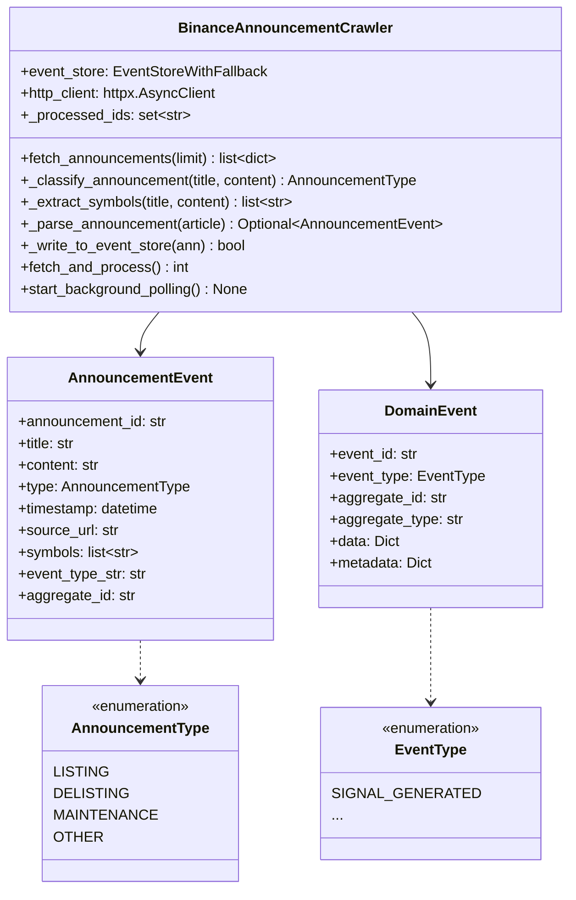
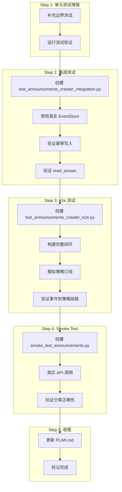

# Task 2.3 事件公告爬虫 - 实现规划

> 架构师视角。基于现有实现分析和验收标准差距识别。

---

## 一、需求分析

### 1.1 任务概述

| 维度 | 描述 |
|------|------|
| **任务名称** | 事件公告爬虫 |
| **所属阶段** | Phase 2 研究信号层 |
| **目标** | 从 Binance 公告源采集事件公告，分类后写入 event_log |
| **stream_key** | `announcements` |

### 1.2 验收标准

| # | 标准 | 当前状态 | 差距 |
|---|------|---------|------|
| 2.3.1 | 新上币公告能被正确分类为 ListingEvent | 分类逻辑已实现 | `AnnouncementType.LISTING` 存在，但未映射到独立的 `EventType` |
| 2.3.2 | 事件写入 event_log，可被策略订阅 | `fetch_and_process()` 写入 event_store | 缺少订阅机制验证的集成/e2e 测试 |

---

## 二、现有实现分析

### 2.1 已实现组件

```
trader/adapters/announcements/
├── __init__.py                 # 导出 BinanceAnnouncementCrawler, AnnouncementEvent
├── binance_crawler.py          # 510 行，完整爬虫实现
└── (测试文件)
    └── trader/tests/test_announcements_crawler.py  # 556 行

trader/core/domain/models/
└── events.py                   # DomainEvent, EventType 定义
```

### 2.2 核心类结构



### 2.3 现有测试覆盖

| 测试类 | 覆盖场景 | 状态 |
|--------|---------|------|
| `TestAnnouncementClassification` | 中英文关键词分类、优先级 | ✅ 覆盖 |
| `TestSymbolExtraction` | 交易对提取、去重、边界情况 | ✅ 覆盖 |
| `TestAnnouncementParsing` | API响应解析、缺失字段 | ✅ 覆盖 |
| `TestFetchAnnouncements` | HTTP请求成功/网络错误/API错误 | ✅ 覆盖 |
| `TestEventWriting` | 幂等写入、写入失败 | ✅ 覆盖 |
| `TestFullFlow` | 完整抓取处理流程 | ✅ 覆盖 |
| `TestLifecycle` | 生命周期管理 | ✅ 覆盖 |
| **集成测试** | announcements 流订阅验证 | ❌ 缺失 |
| **e2e测试** | 策略订阅事件闭环 | ❌ 缺失 |

---

## 三、发现的问题

### 3.1 EventType 语义丢失（高优先级）

**问题**：当前所有 `AnnouncementType` 都映射到 `EventType.SIGNAL_GENERATED`

```python
# binance_crawler.py:311-316
_ANNOUNCEMENT_TO_EVENT_TYPE = {
    AnnouncementType.LISTING: EventType.SIGNAL_GENERATED,
    AnnouncementType.DELISTING: EventType.SIGNAL_GENERATED,
    AnnouncementType.MAINTENANCE: EventType.SIGNAL_GENERATED,
    AnnouncementType.OTHER: EventType.SIGNAL_GENERATED,
}
```

**影响**：
- 策略无法通过 `EventType` 区分公告类型
- 订阅 `announcements` 流的策略需要解析 `data['type']` 才能判断公告类型
- 不符合事件溯源的语义清晰性原则

**建议**：
1. 在 `EventType` 中添加专门的公告事件类型
2. 或者接受当前设计（所有公告都是 SIGNAL_GENERATED），在 data 中携带原始类型

### 3.2 测试覆盖缺口（中优先级）

| 缺口 | 说明 | 影响 |
|------|------|------|
| 集成测试 | 缺少与 EventStoreWithFallback 真实交互的测试 | 无法验证幂等性在真实环境的正确性 |
| e2e 测试 | 缺少策略订阅 announcements 流的验证 | 验收标准 2.3.2 未被测试覆盖 |
| 内存缓存边界 | `_processed_ids` 无上限，可能导致内存泄漏 | 长期运行场景有风险 |
| 内存回退路径 | `get_latest_seq` 返回 None 时的处理逻辑未测试 | 降级场景未覆盖 |

### 3.3 文档注释不一致

**问题**：`binance_crawler.py` 文档说分类为 `ListingEvent`，但实际枚举值是 `AnnouncementType.LISTING`

---

## 四、需要修改的文件

### 4.1 核心实现文件

| 文件 | 修改内容 | 优先级 |
|------|---------|--------|
| `trader/adapters/announcements/binance_crawler.py` | 增强错误处理、添加集成支持 | 中 |
| `trader/core/domain/models/events.py` | 可选：添加 ANNOUNCEMENT_LISTING 等 EventType | 低（当前设计可接受） |

### 4.2 测试文件

| 文件 | 修改内容 | 优先级 |
|------|---------|--------|
| `trader/tests/test_announcements_crawler.py` | 补充边界测试 | 中 |
| `trader/tests/test_announcements_crawler_integration.py` | 新建：集成测试 | 高 |
| `trader/tests/test_announcements_crawler_e2e.py` | 新建：e2e 测试 | 高 |

### 4.3 配置文件

| 文件 | 修改内容 | 优先级 |
|------|---------|--------|
| `PLAN.md` | 标记 Task 2.3 完成 | 低 |

---

## 五、实现步骤

### Step 1: 补充单元测试边界情况

**目标**：增强现有单元测试覆盖边界场景

**操作**：
1. 添加 `_processed_ids` 内存缓存溢出边界测试
2. 添加 `get_latest_seq` 返回 None 时的回退路径测试
3. 添加 `fetch_and_process` 空列表边界测试
4. 添加多语言混合关键词测试

**验收**：新增测试通过

---

### Step 2: 新建集成测试

**目标**：验证与 EventStoreWithFallback 的真实交互

**操作**：
1. 创建 `trader/tests/test_announcements_crawler_integration.py`
2. 使用 `EventStoreWithFallback` 真实实例（in-memory 模式）
3. 测试 `fetch_and_process` 完整流程
4. 验证幂等写入：重复调用不产生重复事件
5. 验证 `read_stream("announcements")` 能读取到写入的事件

**验收**：
- 集成测试通过
- 验证 announcements 流可被读取

---

### Step 3: 新建 e2e 测试

**目标**：验证策略能订阅 announcements 流

**操作**：
1. 创建 `trader/tests/test_announcements_crawler_e2e.py`
2. 使用 fake_broker + mock event_store 构建完整闭环
3. 模拟公告事件触发策略反应
4. 验证事件从爬虫到策略的完整链路

**验收**：
- e2e 测试通过
- 策略能正确接收和处理公告事件

---

### Step 4: 验证真实 API 连接（Smoke Test）

**目标**：至少一次真实 API 验证

**操作**：
1. 创建 `scripts/smoke_test_announcements.py`
2. 实际调用 Binance API 获取公告
3. 验证分类逻辑在真实数据上的正确性

**验收**：
- 脚本执行成功
- 日志显示真实公告被正确分类和写入

---

### Step 5: 更新 PLAN.md

**目标**：标记 Task 2.3 完成

**操作**：
1. 在 Phase 2 Task 2.3 验收标准前添加 ✅
2. 记录完成日期

---

## 六、流程图



---

## 七、风险与回滚

| 风险 | 影响 | 缓解措施 |
|------|------|---------|
| Binance API 限流 | 测试失败 | 使用 mock HTTP client |
| 内存缓存无限增长 | 内存泄漏 | 添加 LRU 缓存或定期清理 |
| EventStore 回退路径未测试 | 生产环境异常 | 补充回退路径测试 |

---

## 八、依赖关系

```
Phase 1 完成
    │
    └── Task 2.3 依赖
            │
            ├── EventStoreWithFallback（Phase 1.6 已完成）
            ├── Feature Store（Phase 1.1 已完成）
            └── DomainEvent 模型（已存在）
```

---

## 九、结论

Task 2.3 的核心功能（爬虫 + 分类 + 写入）已在现有代码中实现，测试覆盖也较为完整。主要缺口在于：

1. **集成测试缺失**：需要验证与真实 EventStore 的交互
2. **e2e 测试缺失**：需要验证策略订阅的完整闭环
3. **边界情况未覆盖**：内存缓存溢出、回退路径等

建议按照实现步骤依次推进，完成后即可满足验收标准。
