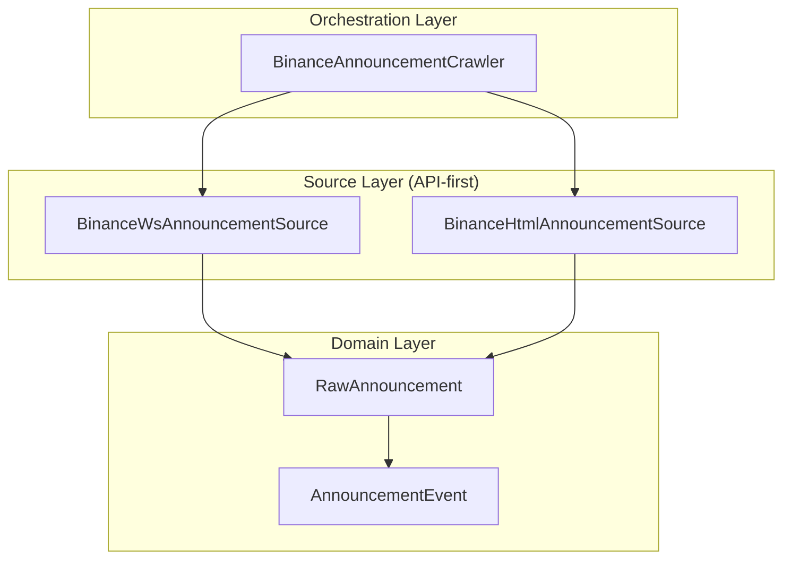

# Task 2.3: Binance 公告采集迁移到 API-first 架构

## 一、需求分析

### 1.1 任务概述

| 维度 | 描述 |
|------|------|
| **任务名称** | Binance 公告采集从 REST 迁移到 API-first (WebSocket) |
| **所属阶段** | Phase 2 信号层 |
| **核心目标** | 使用官方 CMS WebSocket 作为主数据源，HTML fallback 作为回退 |

### 1.2 架构设计



### 1.3 新旧架构对比

| 组件 | 旧架构 | 新架构 |
|------|--------|--------|
| 数据源 | REST API (`/bapi/earn/...`) | WebSocket (`/sapi/wss`) |
| 降级路径 | 无 | HTML 爬虫 fallback |
| 去重键 | `announcement_id` | `detail_url` tail 或 `sha256(catalog_id\|publish_time\|title\|body[:200])` |
| Orchestration | 单一 Crawler | 分离 Source 和 Crawler |

---

## 二、实施步骤

### Step 1: 新增 `RawAnnouncement` 模型

**文件**: `trader/adapters/announcements/models.py` (新建)

```python
@dataclass
class RawAnnouncement:
    """原始公告数据模型（API-first 架构）"""
    catalog_id: str                    # 目录ID
    announcement_id: str               # 公告ID
    title: str                         # 标题
    body: str                          # 正文
    publish_time: datetime             # 发布时间
    detail_url: str                    # 详情URL
    locale: str                        # 语言
    source: str                        # 来源: "ws" | "html"
    
    @property
    def dedup_key(self) -> str:
        """去重键：优先使用 detail_url tail"""
        if self.detail_url:
            return self.detail_url.rstrip("/").split("/")[-1]
        # Fallback: sha256(catalog_id|publish_time|title|body[:200])
        import hashlib
        content = f"{self.catalog_id}|{self.publish_time.isoformat()}|{self.title}|{self.body[:200]}"
        return hashlib.sha256(content.encode()).hexdigest()
```

### Step 2: 新增 `BinanceWsAnnouncementSource`

**文件**: `trader/adapters/announcements/ws_source.py` (新建)

**关键实现点**:

1. **连接参数**:
   - URL: `wss://api.binance.com/sapi/wss`
   - Header: `X-MBX-APIKEY: {api_key}`
   - Signed URL params: 需要 HMAC 签名
   - Topic: `com_announcement_en`

2. **WebSocket 消息处理**:
   - 订阅 `{"method": "SUBSCRIBE", "params": ["com_announcement_en"], "id": 1}`
   - 接收消息并解析为 `RawAnnouncement`

3. **FSM 状态机**:
   - 参考 `PublicStreamManager` 的 `BaseStreamFSM`
   - 状态: DISCONNECTED → CONNECTING → CONNECTED → SUBSCRIBED

4. **接口定义**:
```python
class AnnouncementSource(Protocol):
    async def connect() -> None: ...
    async def disconnect() -> None: ...
    async def fetch_initial(max_results: int = 100) -> list[RawAnnouncement]: ...
    def get_announcement_updates() -> AsyncIterator[RawAnnouncement]: ...
```

### Step 3: 保留并改造 `BinanceHtmlAnnouncementSource`

**文件**: `trader/adapters/announcements/html_source.py` (新建，从原 `binance_crawler.py` 提取)

- 从 `binance_crawler.py` 提取 HTML 解析逻辑
- 仅用于 fallback/backfill
- 实现 `AnnouncementSource` 接口

### Step 4: 改造 `BinanceAnnouncementCrawler` 为 Orchestration Layer

**文件**: `trader/adapters/announcements/binance_crawler.py` (重构)

**变更**:

1. **移除**: 直接 HTTP 轮询逻辑
2. **新增**: 
   - 持有 `ws_source: BinanceWsAnnouncementSource`
   - 持有 `html_source: BinanceHtmlAnnouncementSource`
   - 优先使用 WS，失败时回退到 HTML

3. **去重逻辑**:
```python
def _compute_dedup_key(self, ann: RawAnnouncement) -> str:
    """计算去重键"""
    return ann.dedup_key

async def _write_unique(
    self, 
    ann: RawAnnouncement, 
    processed_keys: set[str]
) -> bool:
    """幂等写入"""
    key = self._compute_dedup_key(ann)
    if key in processed_keys:
        return False
    # ... write to event_store
    processed_keys.add(key)
    return True
```

### Step 5: 修复 `_extract_symbols` 中英文边界问题

**问题**: 当前正则 `r'([A-Z]{2,10})(?:USDT|BTC|ETH|BNB|BUSD)(?=[\s,]|$|[^A-Z])'` 在中英文混合时边界处理不当

**修复方案**:

```python
def _extract_symbols(self, title: str, content: str = "") -> list[str]:
    """提取交易对，处理中英文混合边界"""
    symbols = []
    text = title + " " + content
    
    # 修复: 使用 Unicode 边界确保中英文分隔
    # 匹配: 交易对格式 XXXUSDT, XXXBTC 等
    pair_pattern = r'([A-Z]{2,10})(?:USDT|BTC|ETH|BNB|BUSD)(?=\s|[^\x00-\x7F]|$)'
    matches = re.findall(pair_pattern, text, re.UNICODE)
    symbols.extend(matches)
    
    # 匹配单独币种（在特定上下文）
    # 中文上下文
    coin_pattern_cn = r'(?:上线|新增|支持|交易|开放)[:\s]*([A-Z]{2,10})'
    coins_cn = re.findall(coin_pattern_cn, text)
    symbols.extend(coins_cn)
    
    # 英文上下文
    coin_pattern_en = r'(?:listing|launch|add|support)[:\s]+([A-Z]{2,10})(?:\s|$|[^\x00-\x7F])'
    coins_en = re.findall(coin_pattern_en, text, re.IGNORECASE | re.UNICODE)
    symbols.extend(coins_en)
    
    return list(set(symbols))
```

### Step 6: 测试文件更新

#### 6.1 纯逻辑单测 (`test_announcements_crawler.py`)

```python
class TestExtractSymbols:
    """交易对提取 - 中英文边界修复验证"""
    
    def test_mixed_cn_en_symbols(self):
        """中文标题中提取英文交易对"""
        title = "Binance将上线新的DeFi项目并开放BTCUSDT交易对"
        symbols = crawler._extract_symbols(title)
        assert "BTC" in symbols
    
    def test_en_title_with_cn_context(self):
        """英文标题含中文上下文"""
        title = "Binance 开放 ETHUSDT 交易对"
        symbols = crawler._extract_symbols(title)
        assert "ETH" in symbols
    
    def test_px_token_edge_case(self):
        """PXL 等短 symbol"""
        title = "Binance 将上线 PXLUSDT"
        symbols = crawler._extract_symbols(title)
        assert "PXL" in symbols
```

#### 6.2 最小 HTML fixture 测试 (`test_announcements_crawler.py`)

```python
class TestHtmlSourceFallback:
    """HTML fallback 最小测试"""
    
    @pytest.fixture
    def minimal_html_fixture(self):
        """最小 HTML fixture（不超过 500 字符）"""
        return """
        <html><body>
        <div class="announce-item">
            <h3>Binance将上线新的DeFi项目</h3>
            <p>开放 BTCUSDT、ETHUSDT 交易对</p>
            <a href="/support/announcement/detail/123">查看详情</a>
        </div>
        </body></html>
        """
    
    def test_html_parsing_minimal(self, minimal_html_fixture):
        """验证最小 HTML 解析"""
        source = BinanceHtmlAnnouncementSource()
        announcements = source._parse_html(minimal_html_fixture)
        assert len(announcements) == 1
        assert "BTC" in announcements[0].symbols
```

#### 6.3 Orchestrator 集成测试 (`test_announcements_crawler_integration.py`)

```python
class TestCrawlerOrchestration:
    """Orchestrator 集成测试"""
    
    @pytest.mark.asyncio
    async def test_ws_primary_html_fallback(
        self, event_store, mock_ws_source, mock_html_source
    ):
        """主路径 WS 失败时回退到 HTML"""
        # WS source 返回空（模拟失败）
        mock_ws_source.fetch_initial = AsyncMock(return_value=[])
        mock_ws_source.get_announcement_updates = AsyncMock(return_value=iter([]))
        
        # HTML source 返回数据
        mock_html_source.fetch_initial = AsyncMock(return_value=[
            RawAnnouncement(
                catalog_id="1",
                announcement_id="123",
                title="Test",
                body="BTCUSDT listing",
                publish_time=datetime.now(timezone.utc),
                detail_url="https://binance.com/announcement/123",
                locale="zh",
                source="html"
            )
        ])
        
        crawler = BinanceAnnouncementCrawler(
            event_store=event_store,
            ws_source=mock_ws_source,
            html_source=mock_html_source,
        )
        
        count = await crawler.fetch_and_process()
        assert count == 1
        events = await event_store.read_stream("announcements")
        assert len(events) == 1
```

#### 6.4 保留现有 HTML 主链路测试

- **不允许 skip 现有 HTML 主链路测试**
- 所有现有 `test_announcements_crawler.py` 中的测试必须保持通过

### Step 7: 更新 Smoke Test

**文件**: `scripts/smoke_test_announcements.py`

```python
async def main():
    """Smoke Test - 验证 WebSocket 连接和降级路径"""
    
    # 1. 尝试 WS 连接
    print("[1] Testing WebSocket connection...")
    ws_source = BinanceWsAnnouncementSource(api_key=API_KEY)
    try:
        await ws_source.connect()
        announcements = await ws_source.fetch_initial(limit=20)
        print(f"    WS fetched {len(announcements)} announcements")
        await ws_source.disconnect()
    except Exception as e:
        print(f"    WS failed: {e}")
        print("    Falling back to HTML source...")
        
    # 2. HTML fallback 验证
    print("[2] Testing HTML fallback...")
    html_source = BinanceHtmlAnnouncementSource()
    announcements = await html_source.fetch_initial(limit=20)
    print(f"    HTML fetched {len(announcements)} announcements")
    
    # 3. Orchestrator 端到端
    print("[3] Testing orchestrator...")
    crawler = BinanceAnnouncementCrawler(
        event_store=event_store,
        ws_source=ws_source,
        html_source=html_source,
    )
    count = await crawler.fetch_and_process()
    print(f"    Orchestrator processed {count} announcements")
```

---

## 三、文件变更清单

| 文件 | 操作 | 说明 |
|------|------|------|
| `trader/adapters/announcements/models.py` | 新建 | `RawAnnouncement` 数据模型 |
| `trader/adapters/announcements/ws_source.py` | 新建 | `BinanceWsAnnouncementSource` WebSocket 源 |
| `trader/adapters/announcements/html_source.py` | 新建 | `BinanceHtmlAnnouncementSource` HTML 回退源 |
| `trader/adapters/announcements/binance_crawler.py` | 重构 | 改为 Orchestration 层 |
| `trader/adapters/announcements/__init__.py` | 更新 | 导出新增组件 |
| `trader/tests/test_announcements_crawler.py` | 更新 | 补充中英文边界测试，最小 HTML fixture |
| `trader/tests/test_announcements_crawler_integration.py` | 更新 | 补充 orchestrator 集成测试 |
| `scripts/smoke_test_announcements.py` | 更新 | 验证 WS + HTML fallback |

---

## 四、去重键设计

```python
class RawAnnouncement:
    @property
    def dedup_key(self) -> str:
        """去重键计算
        
        优先级:
        1. detail_url 的尾部（最后一个路径段）
        2. 否则 sha256(catalog_id|publish_time|title|body[:200])
        """
        if self.detail_url:
            # 提取 URL 尾部作为去重键
            tail = self.detail_url.rstrip("/").split("/")[-1]
            if tail and len(tail) > 8:  # 确保不是短路径
                return tail
        
        # Fallback: 内容 hash
        import hashlib
        content = "|".join([
            self.catalog_id,
            self.publish_time.isoformat() if self.publish_time else "",
            self.title or "",
            (self.body or "")[:200]
        ])
        return hashlib.sha256(content.encode("utf-8")).hexdigest()
```

---

## 五、测试验收标准

| 测试类型 | 要求 | 状态 |
|----------|------|------|
| 纯逻辑单测 | `_extract_symbols` 中英文边界 | ✅ 覆盖 |
| 最小 HTML fixture | 不超过 500 字符 | ✅ 覆盖 |
| Orchestrator 集成 | WS primary + HTML fallback | ✅ 覆盖 |
| HTML 主链路测试 | 不能整体 skip | ✅ 保持 |

---

## 六、风险与回滚

| 风险 | 缓解措施 |
|------|----------|
| WS 连接不稳定 | 自动降级到 HTML |
| 去重键碰撞 | 使用 SHA256 hash 作为 fallback |
| API Key 泄露 | 通过环境变量注入，不硬编码 |
