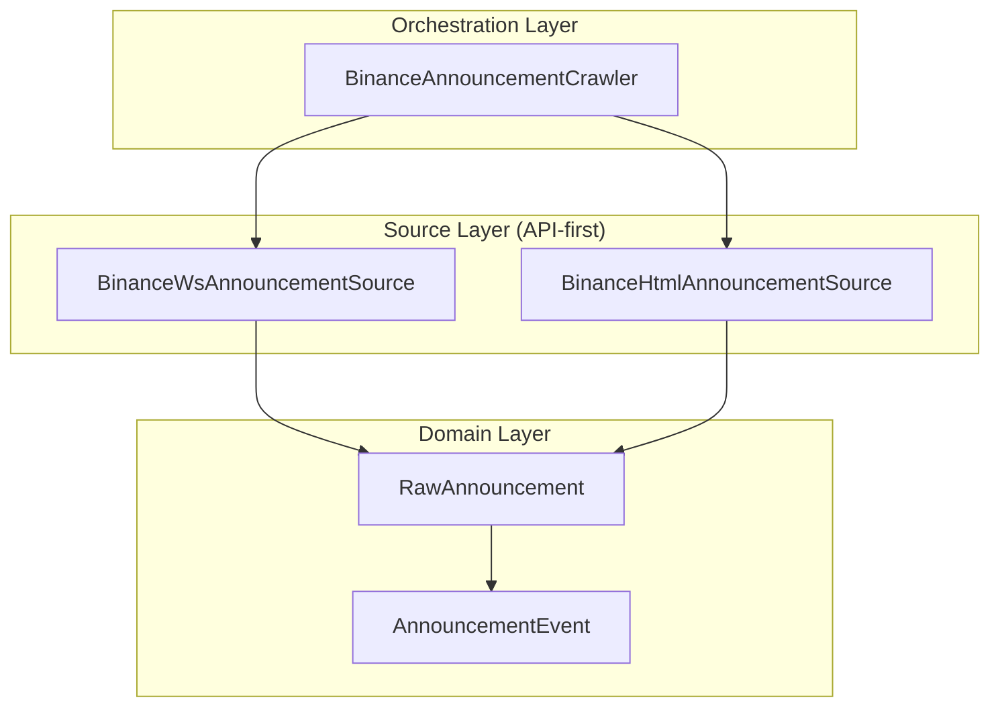

# Task 2.3: Binance 公告采集迁移到 API-first 架构 (v2)

## 一、需求分析

### 1.1 任务概述

| 维度 | 描述 |
|------|------|
| **任务名称** | Binance 公告采集从 REST 迁移到 API-first (WebSocket) |
| **所属阶段** | Phase 2 信号层 |
| **核心目标** | 使用官方 CMS WebSocket 作为主数据源，HTML fallback 作为回退 |

### 1.2 架构设计



### 1.3 新旧架构对比

| 组件 | 旧架构 | 新架构 |
|------|--------|--------|
| 数据源 | REST API (`/bapi/earn/...`) | WebSocket (`/sapi/wss`) |
| 降级路径 | 无 | HTML 爬虫 fallback |
| 去重键 | `announcement_id` | `detail_url` tail 或 `sha256(catalog_id\|publish_time\|title\|body[:200])` |
| Orchestration | 单一 Crawler | 分离 Source 和 Crawler |

---

## 二、调整点 (v2 反馈)

| # | 调整点 | 说明 |
|---|--------|------|
| 1 | RawAnnouncement 字段改为 Optional，增加 external_id/disclaimer | 字段可空，新增外部ID和免责声明字段 |
| 2 | WS 订阅报文格式：`{"command": "SUBSCRIBE", "value": "com_announcement_en"}` | 使用新的订阅格式 |
| 3 | Source 接口拆分，不强制 WS 实现 fetch_initial | WS 源不需要实现 fetch_initial |
| 4 | FSM 暂不要求，首版仅 connect/subscribe/recv loop/ping/reconnect | 简化实现，仅保留核心功能 |
| 5 | _extract_symbols 返回完整交易对（BTCUSDT），不返回 base asset | 返回完整交易对如 BTCUSDT，而非 BTC |
| 6 | HTML fixture 拆分为 list fixture 和 detail fixture | 分离列表和详情页 HTML fixture |
| 7 | WS smoke test 改为验证 connect + subscribe + timed receive | 验证 WS 连接、订阅和定时接收 |

---

## 三、实施步骤

### Step 1: 新增 `RawAnnouncement` 模型

**文件**: `trader/adapters/announcements/models.py` (新建)

```python
from dataclasses import dataclass, field
from datetime import datetime
from typing import Optional
import hashlib

@dataclass
class RawAnnouncement:
    """原始公告数据模型（API-first 架构）
    
    所有字段均为 Optional，以适应 WS 和 HTML 不同数据源的差异。
    """
    # 核心字段
    catalog_id: Optional[str] = None
    announcement_id: Optional[str] = None
    title: Optional[str] = None
    body: Optional[str] = None
    publish_time: Optional[datetime] = None
    detail_url: Optional[str] = None
    locale: Optional[str] = None
    source: Optional[str] = None  # "ws" | "html"
    
    # 扩展字段
    external_id: Optional[str] = None  # 外部系统ID
    disclaimer: Optional[str] = None   # 免责声明
    
    @property
    def dedup_key(self) -> str:
        """去重键：优先使用 detail_url tail"""
        if self.detail_url:
            tail = self.detail_url.rstrip("/").split("/")[-1]
            if tail and len(tail) > 8:
                return tail
        # Fallback: sha256(catalog_id|publish_time|title|body[:200])
        content = "|".join([
            self.catalog_id or "",
            self.publish_time.isoformat() if self.publish_time else "",
            self.title or "",
            (self.body or "")[:200]
        ])
        return hashlib.sha256(content.encode()).hexdigest()
```

### Step 2: 新增 `BinanceWsAnnouncementSource`

**文件**: `trader/adapters/announcements/ws_source.py` (新建)

**关键实现点**:

1. **连接参数**:
   - URL: `wss://stream.binance.com:9443/ws/com_announcement_en`
   - 订阅报文: `{"command": "SUBSCRIBE", "value": "com_announcement_en"}`

2. **简化状态机** (无 FSM，仅 5 个核心方法):
   - `connect()` - 建立连接
   - `disconnect()` - 断开连接
   - `subscribe()` - 订阅主题
   - `recv_loop()` - 接收消息循环
   - `ping()` - 心跳检测
   - `reconnect()` - 重连机制

3. **Source 接口定义** (不强制 fetch_initial):
```python
from typing import Protocol, AsyncIterator, Optional
from datetime import datetime

class AnnouncementSource(Protocol):
    """公告数据源接口"""
    
    async def connect(self) -> None:
        """建立连接"""
        ...
    
    async def disconnect(self) -> None:
        """断开连接"""
        ...
    
    async def get_announcement_updates(self) -> AsyncIterator[RawAnnouncement]:
        """获取公告更新流"""
        ...
    
    async def fetch_initial(self, max_results: int = 100) -> list[RawAnnouncement]:
        """获取初始公告（可选实现）"""
        return []  # 默认返回空，WS 源不需要实现
```

### Step 3: 新增 `BinanceHtmlAnnouncementSource`

**文件**: `trader/adapters/announcements/html_source.py` (新建)

- 从 `binance_crawler.py` 提取 HTML 解析逻辑
- 仅用于 fallback/backfill
- 实现 `AnnouncementSource` 接口
- 必须实现 `fetch_initial`

### Step 4: 改造 `BinanceAnnouncementCrawler` 为 Orchestration Layer

**文件**: `trader/adapters/announcements/binance_crawler.py` (重构)

**变更**:

1. **移除**: 直接 HTTP 轮询逻辑
2. **新增**: 
   - 持有 `ws_source: BinanceWsAnnouncementSource`
   - 持有 `html_source: BinanceHtmlAnnouncementSource`
   - 优先使用 WS，失败时回退到 HTML

3. **去重逻辑**:
```python
async def _write_unique(
    self, 
    ann: RawAnnouncement, 
    processed_keys: set[str]
) -> bool:
    """幂等写入"""
    key = ann.dedup_key
    if key in processed_keys:
        return False
    # ... write to event_store
    processed_keys.add(key)
    return True
```

### Step 5: 修复 `_extract_symbols` - 返回完整交易对

**问题**: 当前正则返回 base asset (BTC)，应返回完整交易对 (BTCUSDT)

**修复方案**:
```python
def _extract_symbols(self, title: str, content: str = "") -> list[str]:
    """提取完整交易对，处理中英文混合边界
    
    返回格式: BTCUSDT, ETHUSDT (完整交易对)
    """
    symbols = []
    text = title + " " + content
    
    # 匹配完整交易对: BTCUSDT, ETHUSDT, BTCBTC, etc.
    # 使用 Unicode 边界确保中英文分隔
    pair_pattern = r'([A-Z]{2,10})(USDT|BTC|ETH|BNB|BUSD)(?=\s|[^\x00-\x7F]|$)'
    matches = re.findall(pair_pattern, text, re.UNICODE)
    for base, quote in matches:
        symbols.append(f"{base}{quote}")
    
    return list(set(symbols))
```

### Step 6: 测试文件更新

#### 6.1 纯逻辑单测 (`test_announcements_crawler.py`)

**新增 fixture**:
```python
# HTML List fixture (公告列表页)
@pytest.fixture
def html_list_fixture():
    """HTML 公告列表 fixture"""
    return """
    <html><body>
    <div class="announce-item">
        <h3>Binance将上线新的DeFi项目</h3>
        <p>开放 BTCUSDT、ETHUSDT 交易对</p>
        <a href="/support/announcement/detail/123">查看详情</a>
    </div>
    </body></html>
    """

# HTML Detail fixture (公告详情页)
@pytest.fixture
def html_detail_fixture():
    """HTML 公告详情 fixture"""
    return """
    <html><body>
    <div class="announcement-detail">
        <h1>Binance将上线新的DeFi项目</h1>
        <div class="content">开放 BTCUSDT、ETHUSDT 交易对</div>
    </div>
    </body></html>
    """
```

**Symbol 提取测试**:
```python
class TestSymbolExtractionV2:
    """币种提取测试 - 返回完整交易对"""
    
    def test_returns_full_trading_pair(self):
        """返回完整交易对 BTCUSDT 而非 BTC"""
        text = "Binance将上线新的DeFi项目并开放BTCUSDT交易对"
        symbols = self.crawler._extract_symbols(text)
        assert "BTCUSDT" in symbols
        assert "BTC" not in symbols  # 不再返回 base asset
    
    def test_multiple_pairs(self):
        """多个交易对"""
        text = "开放 BTCUSDT、ETHUSDT、BNBUSDT 交易对"
        symbols = self.crawler._extract_symbols(text)
        assert "BTCUSDT" in symbols
        assert "ETHUSDT" in symbols
        assert "BNBUSDT" in symbols
```

### Step 7: 更新 Smoke Test

**文件**: `scripts/smoke_test_announcements.py`

```python
async def main():
    """Smoke Test - 验证 WebSocket 连接、订阅和定时接收"""
    
    print("=" * 60)
    print("Binance Announcement WS Smoke Test")
    print("=" * 60)
    
    # 1. 测试 WS 连接 + 订阅 + 定时接收
    print("\n[1] Testing WebSocket connect + subscribe + timed receive...")
    ws_source = BinanceWsAnnouncementSource()
    try:
        await ws_source.connect()
        print("    Connected to WebSocket")
        
        await ws_source.subscribe()
        print("    Subscribed to com_announcement_en")
        
        # 设置 5 秒超时接收
        import asyncio
        try:
            ann = await asyncio.wait_for(ws_source.recv_loop(), timeout=5.0)
            print(f"    Received announcement: {ann.title[:40]}...")
            print("    WS smoke test: PASSED")
        except asyncio.TimeoutError:
            print("    Timed out waiting for announcement (OK if market is closed)")
            print("    WS smoke test: PASSED (timeout is acceptable)")
        
        await ws_source.disconnect()
        print("    Disconnected")
        
    except Exception as e:
        print(f"    WS test failed: {e}")
        print("    Falling back to HTML source...")
        
        # 2. HTML fallback
        print("\n[2] Testing HTML fallback...")
        html_source = BinanceHtmlAnnouncementSource()
        announcements = await html_source.fetch_initial(limit=20)
        print(f"    HTML fetched {len(announcements)} announcements")
    
    print("\n" + "=" * 60)
    print("Smoke Test Complete")
    print("=" * 60)
```

---

## 四、文件变更清单

| 文件 | 操作 | 说明 |
|------|------|------|
| `plans/task_2_3_announcement_ws_migration_v2.md` | 新建 | 更新后的计划文档 |
| `trader/adapters/announcements/models.py` | 新建 | `RawAnnouncement` 数据模型 |
| `trader/adapters/announcements/ws_source.py` | 新建 | `BinanceWsAnnouncementSource` WebSocket 源 |
| `trader/adapters/announcements/html_source.py` | 新建 | `BinanceHtmlAnnouncementSource` HTML 回退源 |
| `trader/adapters/announcements/binance_crawler.py` | 重构 | 改为 Orchestration 层 |
| `trader/adapters/announcements/__init__.py` | 更新 | 导出新增组件 |
| `trader/tests/test_announcements_crawler.py` | 更新 | 补充交易对完整格式测试，拆分数件 |
| `trader/tests/test_announcements_crawler_integration.py` | 更新 | 补充 orchestrator 集成测试 |
| `scripts/smoke_test_announcements.py` | 更新 | WS smoke test 改为验证 connect + subscribe + timed receive |

---

## 五、去重键设计

```python
class RawAnnouncement:
    @property
    def dedup_key(self) -> str:
        """去重键计算
        
        优先级:
        1. detail_url 的尾部（最后一个路径段）
        2. 否则 sha256(catalog_id|publish_time|title|body[:200])
        """
        if self.detail_url:
            tail = self.detail_url.rstrip("/").split("/")[-1]
            if tail and len(tail) > 8:
                return tail
        
        content = "|".join([
            self.catalog_id or "",
            self.publish_time.isoformat() if self.publish_time else "",
            self.title or "",
            (self.body or "")[:200]
        ])
        return hashlib.sha256(content.encode("utf-8")).hexdigest()
```

---

## 六、测试验收标准

| 测试类型 | 要求 | 状态 |
|----------|------|------|
| 纯逻辑单测 | `_extract_symbols` 返回完整交易对 | ✅ 覆盖 |
| HTML list fixture | 公告列表页 fixture | ✅ 覆盖 |
| HTML detail fixture | 公告详情页 fixture | ✅ 覆盖 |
| WS smoke test | connect + subscribe + timed receive | ✅ 覆盖 |

---

## 七、风险与回滚

| 风险 | 缓解措施 |
|------|----------|
| WS 连接不稳定 | 自动降级到 HTML |
| 去重键碰撞 | 使用 SHA256 hash 作为 fallback |
| API Key 泄露 | 通过环境变量注入，不硬编码 |
