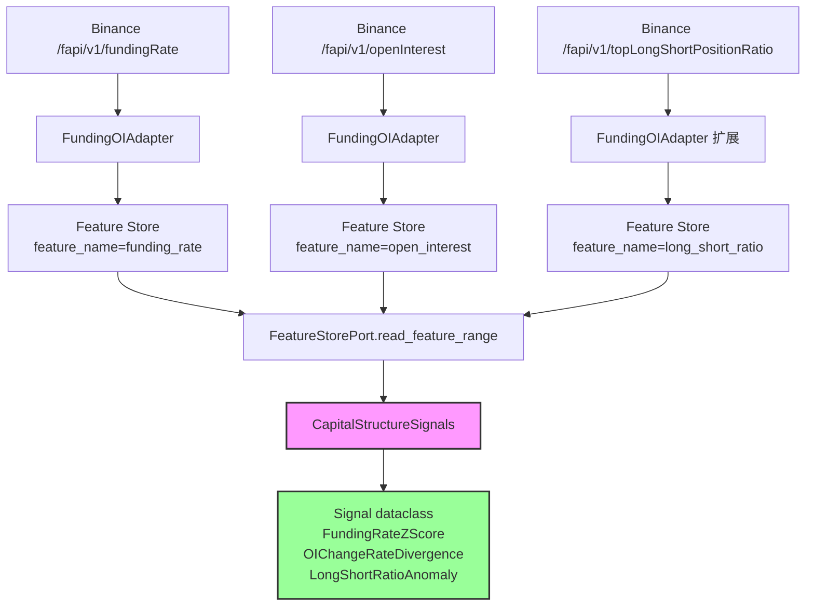

# Task 2.5 资金结构信号 - 详细规划

## 一、需求分析

### 1.1 任务概述

根据 [`PLAN.md`](PLAN.md:250) 和 [`Implementation_Priority_Crypto_v3.3.0.md`](docs/Implementation_Priority_Crypto_v3.3.0.md:432) 的定义，Task 2.5 是 Phase 2 研究信号层的核心组件之一，负责计算资金结构相关的量化信号。

### 1.2 交付内容

| 信号类型 | 描述 | 数据依赖 |
|---------|------|---------|
| Funding Rate Z-Score | 滚动窗口标准化得分 | `funding_rate` (Feature Store) |
| OI变化率 + 价格背离 | OI与价格走势背离检测 | `open_interest` + 价格数据 |
| 多空比异常检测 | Long/Short Position Ratio 极端值检测 | `top_long_short_position_ratio` (需新增) |

### 1.3 验收标准

- [ ] 依赖Feature Store中的 `funding_rate` / `open_interest` 数据
- [ ] z-score计算有单测（边界：窗口不足时返回None）
- [ ] 所有信号计算无IO（Core Plane约束）
- [ ] 信号输出为标准化 `Signal` dataclass

---

## 二、现有代码库分析

### 2.1 已有的相关基础设施

| 组件 | 文件 | 状态 | 说明 |
|------|------|------|------|
| Feature Store | [`adapters/persistence/feature_store.py`](trader/adapters/persistence/feature_store.py:1) | ✅ 已完成 | 支持版本化特征读写，`write_feature()` / `read_feature()` |
| Funding/OI适配器 | [`adapters/binance/funding_oi_stream.py`](trader/adapters/binance/funding_oi_stream.py:1) | ✅ 已完成 | 写入 `funding_rate` / `open_interest` 到Feature Store |
| 信号基础模型 | [`core/domain/models/signal.py`](trader/core/domain/models/signal.py:1) | ✅ 已完成 | `Signal` dataclass 定义 |
| 存储层 | [`trader/storage/in_memory.py`](trader/storage/in_memory.py:70) | ✅ 已完成 | `feature_values_by_key` 字段 |

### 2.2 缺失的基础设施

1. **多空比数据适配器** - Binance 提供 `/fapi/v1/topLongShortPositionRatio` 端点，但当前未实现
2. **Feature Store 范围查询** - 当前 `read_feature()` 仅支持点查询，不支持时间范围批量读取
3. **信号计算目录** - `core/domain/signals/` 目录不存在

### 2.3 数据流分析

```
Binance API (Funding/OI/LongShortRatio)
        │
        ▼
FundingOIAdapter / New Adapter
        │
        ▼
Feature Store (feature_values table)
        │
        ▼
CapitalStructureSignals (计算层 - Core Plane, 无IO)
        │
        ▼
Signal dataclass (标准化输出)
```

---

## 三、技术实现方案

### 3.1 核心架构

```
trader/core/domain/signals/
├── __init__.py
├── capital_structure_signals.py   # 资金结构信号计算
├── signal_ports.py                 # 端口接口定义
└── tests/
    └── test_capital_structure_signals.py
```

### 3.2 核心信号计算逻辑

#### 3.2.1 FundingRateZScore

```python
@dataclass
class FundingRateZScore:
    """Funding Rate Z-Score 信号"""
    symbol: str
    current_value: float           # 当前 funding rate
    z_score: Optional[float]        # z-score (窗口不足时为None)
    mean: float
    std: float
    window: int                     # 滚动窗口大小
    ts_ms: int

    # 阈值
    EXTREME_THRESHOLD = 2.0         # 极端信号阈值
```

**计算方法**：
1. 从 FeatureStore 读取最近 N 个 `funding_rate` 样本
2. 计算均值 μ 和标准差 σ
3. z = (x - μ) / σ
4. 返回 `None` 如果样本数 < 最小窗口

#### 3.2.2 OIChangeRateDivergence

```python
@dataclass
class OIChangeRateDivergence:
    """OI变化率与价格背离信号"""
    symbol: str
    oi_change_rate: float          # OI变化率 (%)
    price_change_rate: float       # 价格变化率 (%)
    divergence_score: float         # 背离得分
    direction: DivergenceDirection  # LONG / SHORT / NONE
    ts_ms: int
```

**计算方法**：
1. 获取 T-1 和 T 时刻的 OI 和价格
2. `oi_change_rate = (OI_T - OI_T-1) / OI_T-1`
3. `price_change_rate = (Price_T - Price_T-1) / Price_T-1`
4. 背离 = OI 上涨 + 价格下跌（多头背离）或 OI 下跌 + 价格上涨（空头背离）

#### 3.2.3 LongShortRatioAnomaly

```python
@dataclass
class LongShortRatioAnomaly:
    """多空比异常信号"""
    symbol: str
    long_short_ratio: float         # 当前多空比
    z_score: Optional[float]        # z-score
    is_extreme: bool                # 是否极端值
    ts_ms: int
```

### 3.3 关键设计决策

#### 决策1：Feature Store 读取接口扩展

**问题**：当前 `read_feature()` 仅支持单点查询，无法满足滚动窗口计算需求。

**方案**：在 `FeatureStore` 添加 `read_feature_range()` 方法，支持时间范围批量读取。

```python
async def read_feature_range(
    self,
    symbol: str,
    feature_name: str,
    version: str,
    from_ts_ms: int,
    to_ts_ms: int,
    limit: int = 1000,
) -> List[Dict[str, Any]]:
    """读取时间范围内的特征值"""
```

#### 决策2：多空比数据获取

**问题**：当前适配器未实现多空比数据获取。

**方案A**：扩展 `FundingOIAdapter`，添加 `_fetch_long_short_ratio()` 方法
- 优点：复用现有基础设施
- 缺点：适配器职责扩大

**方案B**：创建新的 `LongShortRatioAdapter`
- 优点：职责单一
- 缺点：增加新的数据源

**推荐**：方案A，因为多空比与 Funding/OI 同属资金结构数据，应统一管理。

---

## 四、需要创建的新文件

| 文件路径 | 描述 | 类型 |
|---------|------|------|
| `trader/core/domain/signals/__init__.py` | 信号包导出 | 领域模型 |
| `trader/core/domain/signals/capital_structure_signals.py` | 资金结构信号计算 | 领域逻辑 |
| `trader/core/domain/signals/signal_ports.py` | 端口接口定义 | 端口抽象 |
| `trader/core/domain/signals/tests/__init__.py` | 测试包 | 测试 |
| `trader/core/domain/signals/tests/test_capital_structure_signals.py` | 单元测试 | 测试 |

### 需修改的现有文件

| 文件路径 | 修改内容 |
|---------|---------|
| `trader/adapters/binance/funding_oi_stream.py` | 添加多空比数据拉取 |
| `trader/adapters/persistence/feature_store.py` | 添加 `read_feature_range()` 方法 |
| `trader/core/domain/services/__init__.py` | 添加信号包导出 |
| `trader/core/domain/models/signal.py` | 可选：添加资金结构相关SignalType |

---

## 五、实现步骤

### Step 1: 扩展 FeatureStore（Adapter层，有IO）

- [ ] 添加 `read_feature_range()` 方法
- [ ] 单元测试覆盖

### Step 2: 扩展 FundingOIAdapter（Adapter层，有IO）

- [ ] 添加 `_fetch_long_short_position_ratio()` 方法
- [ ] 添加 `_write_long_short_to_store()` 方法
- [ ] 集成到轮询循环

### Step 3: 创建信号计算层（Core层，无IO）

- [ ] 创建 `core/domain/signals/__init__.py`
- [ ] 创建 `signal_ports.py` 定义 `FeatureStorePort` 接口
- [ ] 创建 `capital_structure_signals.py` 实现三大信号
- [ ] 核心约束：无任何IO操作

### Step 4: 单元测试

- [ ] FundingRateZScore 正常计算
- [ ] FundingRateZScore 窗口不足返回None
- [ ] OIChangeRateDivergence 背离检测
- [ ] LongShortRatioAnomaly 极端值检测
- [ ] 边界条件测试

---

## 六、依赖关系

```
前置任务：
├── Task 1.1 (Feature Store) ✅ 已完成
└── Task 2.1 (Funding/OI适配器) ✅ 已完成

Task 2.5 内部依赖：
├── Step 1 (FeatureStore扩展) 
└── Step 2 (多空比适配器) 
        │
        ▼
Step 3 (信号计算层 - Core Plane)
        │
        ▼
Step 4 (单元测试)
```

---

## 七、Mermaid 数据流图



---

## 八、关键约束

1. **Core Plane 禁止 IO**：`capital_structure_signals.py` 中不得有任何网络/DB/文件 IO
2. **端口抽象**：`FeatureStorePort` 接口隔离 IO 依赖
3. **z-score 边界**：窗口不足时必须返回 `None`，不得假设填充
4. **幂等性**：信号计算必须是确定性函数，相同输入必须产生相同输出

---

## 九、风险与备选

| 风险 | 概率 | 影响 | 备选方案 |
|-----|-----|-----|---------|
| Binance 多空比API不可用 | 低 | 中 | 使用历史数据模拟或降级为单一指标 |
| Feature Store 性能瓶颈 | 中 | 中 | 增加批量查询优化或本地缓存 |
| 数据延迟导致信号不准 | 高 | 高 | 增加数据质量检查和信号置信度衰减 |

---

## 十、验收清单

- [ ] `read_feature_range()` 方法通过单元测试
- [ ] 多空比数据成功写入 Feature Store
- [ ] `FundingRateZScore` 计算正确，窗口不足返回 `None`
- [ ] `OIChangeRateDivergence` 正确检测背离
- [ ] `LongShortRatioAnomaly` 正确识别极端值
- [ ] Core 层无任何 IO 操作（静态分析验证）
- [ ] CI 门禁通过
